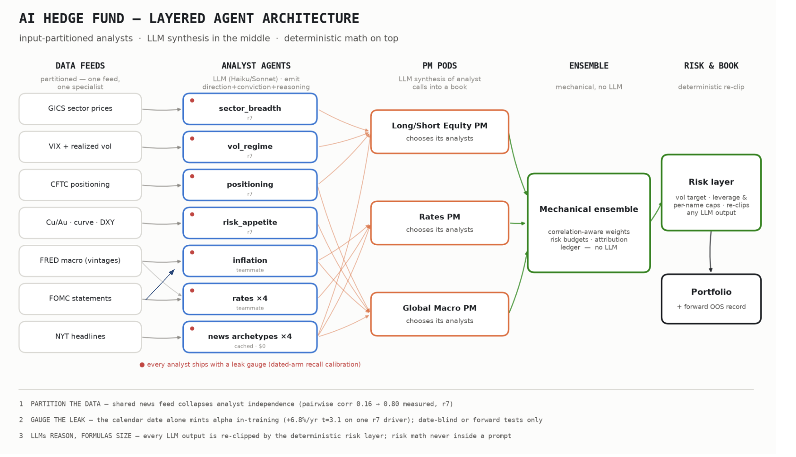

# Analyst upstream — data → agent → report

This repo is the **upstream** of the layered agent fund: the partitioned **data
feeds** and the **analyst agents** that turn each feed into a single, scoreable
report about one macro driver. It hands off to the rest of the fund at one typed
seam — the `DriverView` contract — and nothing here reaches above that line.



The two left-hand columns are what this repo owns. Each analyst reads **only its own
driver's** evidence — engineered *measurements* (what moved) and driver-specific
*policy language* (why it moved) — and writes a report with a direction, a
conviction, and a falsifier. The PM pods, mechanical ensemble, and risk layer
downstream are other teammates' work; they consume `DriverView` and build against
`StrategyTrade` / `FundAllocation` (both defined in `src/layered/contracts.py`, the
merge seam).

The full design record — every decision and why — is `docs/analyst-layer.md`.

## Why it is shaped this way

Two structural defects in the earlier analyst path are what this design removes
(`docs/analyst-layer.md` §1): the numeric arm put the finished answer *into* the
prompt and asked the model to agree, and the text arm sent every analyst identical
bytes. Both are fixed by changing what crosses the first boundary — an analyst now
receives two channels about its own driver and nothing else, and the model supplies
all the judgment. Two invariants make that structural rather than aspirational:

- **Measurements, never signals.** Features come from a *closed* vocabulary of
  operations (`src/layered/features/ops.py`) — levels, changes, spreads, ranges. No
  op fits a parameter, standardizes on the full sample, or scores a direction, so a
  feature spec *cannot express a forecast*.
- **No look-ahead.** Every series is release-dated on load and every read goes
  through the `AsOf` gate (`src/layered/timeline.py`), so a feature at time *t* is
  computed from data available at *t* and nothing later.

## Layout

```
src/
  data/          feeds — markets.py · fred_local.py (vendored CSVs) · fomc_text.py
  llm/           anthropic_client.py — forced-tool structured output, fail-fast
  layered/
    contracts.py DriverView (the seam) + StrategyTrade + FundAllocation
    timeline.py  AsOf — the single no-lookahead choke point
    features/    spec · ops · engine — the measurement vocabulary
    text/        selector · cue · whole — FOMC language, partitioned by driver
    analysts/    llm_analyst · carry_forward · build (shared harness) · personas/*.yaml
    evaluation/  ic · panel · report_quality — grading + the leak gauge
  run_analyst.py · run_analyst_ic.py · run_feature_ic.py · compare_sweep.py
data/fred/       vendored FRED CSVs — runs offline, no key
tests/           focused suite, no LLM calls
scripts/         fetch_fred.py — add a FRED series (needs a key)
```

## Setup

```bash
pip install -r requirements.txt
# Data runs offline out of the box (CSVs vendored in data/fred/).
export ANTHROPIC_API_KEY=...    # only for the scored LLM runs
```

## Running it

**1 — Free feature check (no key, no spend).** Is a driver predictable at all from
measurements available at the time? Run this first; it also validates a persona's
wiring end to end.

```bash
python3 -m src.run_feature_ic --driver inflation
python3 -m src.run_feature_ic --driver curve_slope --start 2005-01-01
```

**2 — Inspect the exact prompt (no spend).**

```bash
python3 -m src.run_analyst --driver labor_tightness --dry-run --asof 2023-08-01
```

**3 — Scored LLM run.** One call per release on the driver's clock, scored by the
same `ICEvaluator` the features use.

```bash
python3 -m src.run_analyst_ic --driver inflation --model claude-haiku-4-5-20251001 \
    --out reports/inflation_haiku.jsonl
python3 -m src.compare_sweep reports/sweep_haiku.jsonl reports/sweep_opus.jsonl
```

**Cost.** A full 2005→2026 run is ~255 calls ≈ **$1 on Haiku**, but ~**$13 on Opus**
(≈$0.05/call). While iterating on a persona, use a short window — e.g.
`--start 2022-01-01 --limit 24` is ~24 calls (~$0.10 Haiku, ~$1.2 Opus) and still
spans the 2022–23 tightening. Widen to the full window only for a final read.

## Adding an analyst = a YAML file

Copy `src/layered/analysts/personas/_TEMPLATE.yaml` to `<driver>.yaml`, fill in the
`mandate` / `features` / `text_cues` / `horizon` blocks, and it runs — no code. The
feature engine, isolation gate, prompts, carry-forward, and grading are all
driver-agnostic. Validate for free with `run_feature_ic --driver <driver>` before
spending anything on an LLM run.

Drivers currently defined (`personas/`):

| driver | data | status |
|---|---|---|
| `inflation` | CPI, core PCE | built, validated, LLM-run |
| `labor_tightness` | UNRATE | built, feature-validated offline |
| `curve_slope` | 2s10s (DGS2/DGS10) | built, feature-validated offline |
| `term_premium` | 10y yield proxy | built, feature-validated offline |
| `balance_sheet` | WALCL | built — needs `scripts/fetch_fred.py WALCL` |
| `financial_conditions` | NFCI | built — needs `scripts/fetch_fred.py NFCI` |
| `inflation_expectations` | T10YIE | built — needs `scripts/fetch_fred.py T10YIE` |

Market-clock drivers (curve, term premium, breakevens) trade daily, so their persona
sets `horizon.clock_freq: ME` — the evaluation clock is sampled to month-end, keeping
observations non-overlapping and the t-statistic honest.

## Data

FRED CSVs are vendored in `data/fred/` (public-domain), so the repo runs offline. To
add a series a persona needs:

```bash
export FRED_API_KEY=...                     # free: fred.stlouisfed.org
python3 scripts/fetch_fred.py WALCL NFCI T10YIE
```

The FOMC statement corpus is read from the sibling `watching-crowding-build` repo (or
`FOMC_DOCS_PATH`); only the text channel needs it.

## Tests

```bash
python3 -m pytest tests/          # no keys, no network
```

No-lookahead, input isolation, the closed op vocabulary, persona validity, the prompt
guardrails (no answer / no date in the prompt, pairwise-distinct across analysts), and
the seam contract. (If your environment autoloads a broken pytest plugin, run with
`PYTEST_DISABLE_PLUGIN_AUTOLOAD=1`.)
